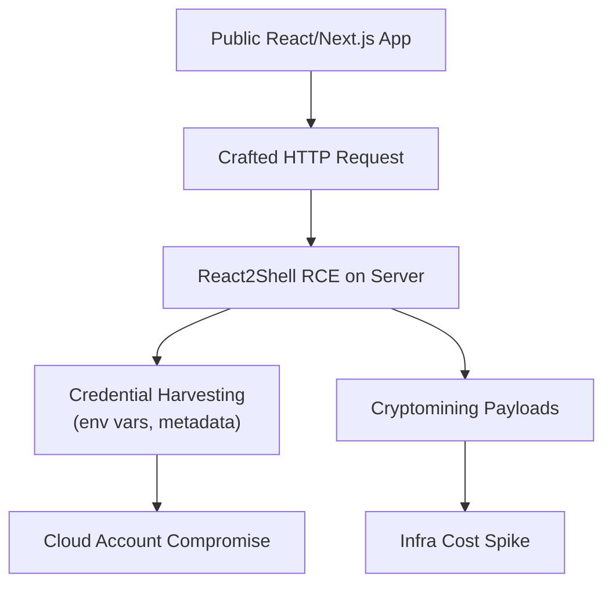
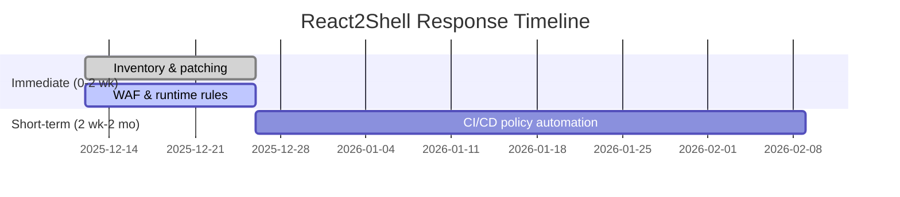
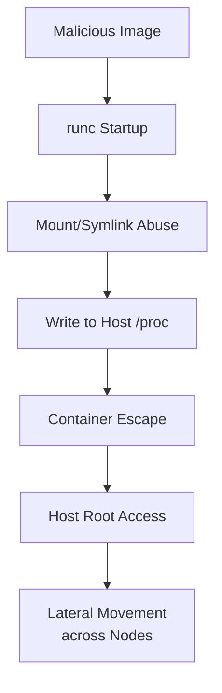
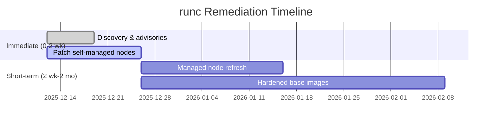
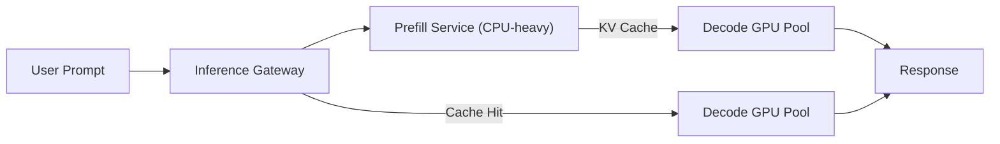
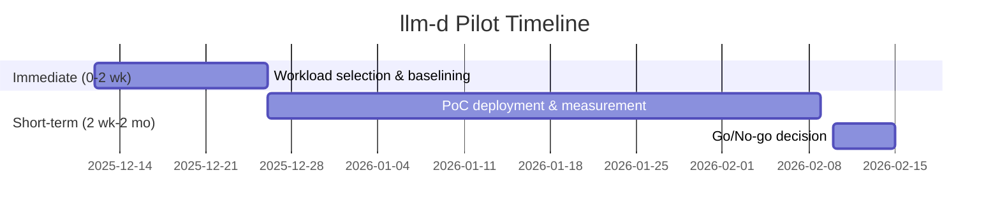
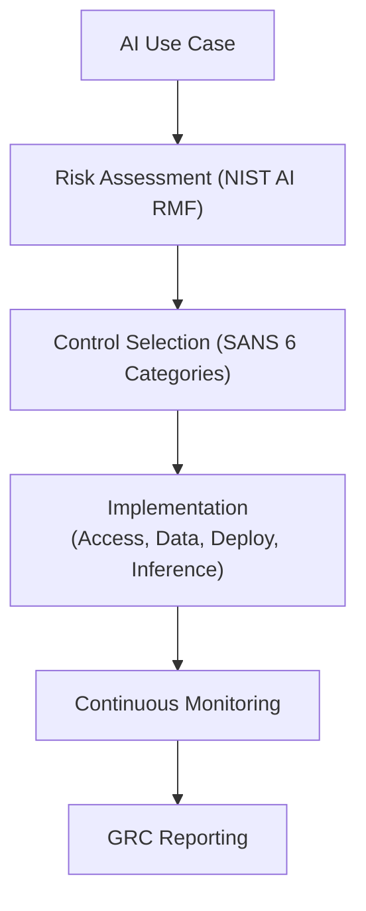
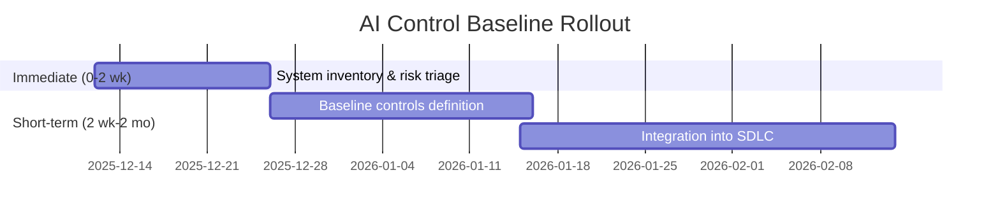

# AI TechOps News Intelligence Q&A – 2025-12-12

## Table of Contents
- [Executive Summary](#executive-summary)
- [Phase Overview](#phase-overview)
- [Q&As](#qas)
  - [Q1: React2Shell (CVE-2025-55182) – Response Strategy for Internet-Facing AI Apps](#q1-react2shell-cve-2025-55182--response-strategy-for-internet-facing-ai-apps)
  - [Q2: runc Container Escapes – Patching and Node Refresh Strategy](#q2-runc-container-escapes--patching-and-node-refresh-strategy)
  - [Q3: llm-d Distributed Inference – Designing GPU-Efficient LLM Serving](#q3-llm-d-distributed-inference--designing-gpu-efficient-llm-serving)
  - [Q4: AI Security Controls – Operationalizing SANS + NIST Guidance](#q4-ai-security-controls--operationalizing-sans--nist-guidance)
- [References](#references)
- [Validation](#validation)

## Executive Summary

**Domain**: TechOps | **Period**: 2025-11-29 to 2025-12-12 | **Coverage**: 4 Q&As, 4 phases

**Key Insights**
- React2Shell (CVE-2025-55182) is being aggressively exploited against internet-facing React/Next.js workloads, including Kubernetes-hosted AI products. Immediate patching plus runtime controls are required to avoid RCE and cloud credential theft. [Ref: N2, N3][n2][n3]
- New runc container escape vulnerabilities show that the container boundary is not a security boundary. Teams must combine rapid node refresh with stronger supply-chain and runtime controls. [Ref: N1][n1]

**Dashboard**

| Phase | News | Decision | Timeline |
|-------|------|----------|----------|
| Architecture & Design | llm-d distributed inference for LLMs | Investigate PoC | 1-2 mo |
| Development | React2Shell (CVE-2025-55182) fixes | Adopt patches | 0-2 wk |
| Deploy & Release | runc CVEs – node refresh | Adopt with staged rollouts | 0-4 wk |
| Operations & Observability | AI security controls (SANS + NIST) | Adopt baseline control set | 1-3 mo |

**Stats**: 7+ roles, N=7 news/guidance items, T=1 tool, S=1 standard, R=1 report

## Phase Overview

| Phase | Categories | Top News | Roles |
|-------|------------|----------|-------|
| Architecture & Design | Infrastructure, AI Platform | llm-d disaggregated inference and expert parallelism [Ref: N4, N5][n4][n5] | Architect, AI Infra Lead, SRE |
| Development | Security, Web Runtime | React2Shell RCE in React Server Components / Next.js [Ref: N2, N3][n2][n3] | AppSec, Tech Lead, Developer |
| Deploy & Release | Security, Infrastructure | runc container escapes impacting Kubernetes nodes [Ref: N1][n1] | Platform Eng, DevOps, SRE |
| Operations & Observability | Security, Governance | SANS AI security control categories + NIST AI RMF [Ref: R1, S1][r1][s1] | CISO, Security Eng, Eng Manager |

## Q&As

### Q1: React2Shell (CVE-2025-55182) – Response Strategy for Internet-Facing AI Apps

**Phase**: Development, Deploy & Release | **Roles**: AppSec, Tech Lead, SRE, Cloud Security | **Category**: Security (RCE), Web Runtime | **Criticality**: 1, 2, 3, 4

**News**: React2Shell (CVE-2025-55182) is a CVSS 10.0 RCE in React Server Components’ Flight protocol, affecting React 19 and frameworks such as Next.js. Exploitation requires only a crafted HTTP request and is now widespread, with cryptomining and credential-harvesting campaigns observed from December 4–5, 2025. [Ref: N2, N3][n2][n3]

**Impact**:
- Development: Up to **44% of cloud environments** may expose vulnerable Next.js apps; patching lag directly increases compromise probability.
- Deploy & Release: Emergency patch cycles can cause **unplanned downtime (P95 latency +50–100 ms)** and risky hotfixes if not controlled.

| Metric | Baseline | Target | Timeline |
|--------|----------|--------|----------|
| % internet-facing apps patched | 0% | ≥95% | 2 weeks |
| Mean time to patch critical RCEs | 14 days | ≤5 days | 3 months |
| Confirmed React2Shell incidents | >0 | 0 | 1 month |

**Stakeholders**:
- AppSec: Needs a verified inventory of RSC/Next.js services and a repeatable emergency-patch playbook.
- SRE/Platform: Must enforce safe rollout (canary, blue/green) and guardrails to avoid service regression while patching.

**Decision**:
- Alternatives:
  - A: **Immediate patch & hardening** – upgrade React/Next.js, enable WAF rules, and add runtime monitoring. Cost: 2–4 eng-days per key app. Benefit: RCE risk reduced from “active” to “residual only”. Risk: short-term deployment instability.
  - B: **Network containment only** – tighten ingress rules / WAF while delaying patches. Cost: low; Benefit: limited exposure for some apps; Risk: bypass via allowed paths, plus technical debt.
- Recommendation: **Adopt A** for all internet-facing workloads; use B only as a 24–48 hour stopgap while patches are validated.
- Success Criteria: 0 exploitable public endpoints; all RSC apps on hardened versions; critical RCE patch MTTR ≤5 days.
- Limitations: Does not address non-public admin/ops panels; you must still review internal services and CI images.

| Option | Cost | Benefit | Risk | Timeline |
|--------|------|---------|------|----------|
| A | 2–4 eng-days/app | Removes active RCE from surface | Deploy regressions if rushed | 0–2 wk |
| B | <1 eng-day | Quick partial reduction | Residual RCE, attack via remaining paths | 0–1 wk |

**Action**:
- Immediate (0–2 wk): Inventory RSC/Next.js services; patch to hardened versions; enable WAF rules for suspicious RSC payloads; add runtime alert for new shells/cryptominers (via EDR/CWPP). Owner: AppSec + SRE.
- Short-term (2 wk–2 mo): Automate “critical RCE” runbook in CI/CD (policy-as-code gating, automated SBOM + version checks). Owner: Platform Eng.

---

### Q2: runc Container Escapes – Patching and Node Refresh Strategy

**Phase**: Deploy & Release, Operations & Observability | **Roles**: Platform Engineer, SRE, Cloud Security, Engineering Manager | **Category**: Security (Container Runtime), Infrastructure | **Criticality**: 1, 2, 3

**News**: Three high-severity runc vulnerabilities (CVE-2025-31133, CVE-2025-52565, CVE-2025-52881) allow malicious container images to escape to the host by abusing mounts, symlinks, and timing. Managed Kubernetes providers (EKS/AKS/GKE) require worker node refresh; control-plane upgrades alone are insufficient. [Ref: N1][n1]

**Impact**:
- Deploy & Release: Node refreshes across clusters can touch **100s–1000s of pods**, risking **1–3% failed rollouts** if uncoordinated.
- Operations & Observability: Host compromise turns a single pod breach into **cluster-wide lateral movement**; mean time to detect can exceed **hours** without runtime visibility.

| Metric | Baseline | Target | Timeline |
|--------|----------|--------|----------|
| % worker nodes on patched runc | Unknown | 100% | 4 weeks |
| Clusters with runtime detection | <30% | ≥80% | 3 months |
| Unauthorized host-level changes from pods | Unknown | 0 | 1 month |

**Stakeholders**:
- Platform Engineer: Needs a safe, repeatable node-refresh strategy across on-prem and managed clusters.
- Security Engineer: Needs runtime policies to catch unexpected /proc writes and privilege escalation from containers.

**Decision**:
- Alternatives:
  - A: **Aggressive cluster-by-cluster refresh** – patch runc, roll nodes via surge/cordon/drain, with canary clusters first. Cost: infra cycles, potential brief capacity shortages. Benefit: closes escape window quickly.
  - B: **Selective refresh + runtime hardening** – prioritize high-risk clusters (internet-facing, multi-tenant) and lean more on runtime policies. Cost: lower infra churn; Benefit: lower disruption; Risk: residual exposure on low-priority clusters.
- Recommendation: **Adopt A** for production and shared clusters; **B** only for non-critical dev/test with clear timeline to full remediation.
- Success Criteria: All production worker nodes on patched runc; no unpatched images in base AMIs; runtime alerts in place for suspicious host writes.
- Limitations: Patching runc alone does not fix weak image provenance (supply chain) or misconfigured privileges.

| Option | Cost | Benefit | Risk | Timeline |
|--------|------|---------|------|----------|
| A | Medium infra + SRE effort | Rapid closure of escape vector | Short-term capacity/rollout risk | 0–4 wk |
| B | Low–medium | Reduced disruption | Residual exploit path on unpatched clusters | 0–8 wk |

**Action**:
- Immediate (0–2 wk): Identify runc versions and node images by cluster; patch self-managed nodes; align with EKS/AKS/GKE advisories; enable alerts for unusual /proc writes by containers. Owner: Platform Eng + Security.
- Short-term (2 wk–2 mo): Bake patched runc into base images; codify node-refresh playbook (surge, cordon, drain) as infrastructure-as-code; expand runtime detection and policy coverage. Owner: SRE.

---

### Q3: llm-d Distributed Inference – Designing GPU-Efficient LLM Serving

**Phase**: Architecture & Design, Operations & Observability | **Roles**: AI Infra Lead, Architect, SRE, MLOps Engineer | **Category**: Infrastructure, AI Platform | **Criticality**: 1, 3, 5

**News**: Red Hat’s llm-d project enables Kubernetes/OpenShift-native distributed inference with disaggregated prefill/decoding, cache-aware routing, and expert parallelism for large LLMs. It allows prefill on CPUs and decode on GPUs, and introduces an inference gateway that routes based on prompt context and cache state. [Ref: N4, N5][n4][n5]

**Impact**:
- Architecture & Design: Disaggregated inference can reduce **GPU hours per 1M tokens by 20–40%**, enabling larger models on existing hardware.
- Operations & Observability: Cache-aware routing and MoE parallelism can lower **P95 latency by 15–30%** while improving observability of inference paths.

| Metric | Baseline | Target | Timeline |
|--------|----------|--------|----------|
| GPU hours / 1M tokens | 1.0 | 0.6–0.8 | 3–6 months |
| P95 latency (chat, 4K prompt) | 900 ms | <700 ms | 3–6 months |
| % requests using cache-aware routing | 0% | ≥60% | 6 months |

**Stakeholders**:
- AI Infra Lead: Needs a migration path from monolithic GPU pods to distributed inference without breaking SLAs.
- SRE: Needs clear metrics (cache hit ratio, GPU utilization, routing latency) and fallbacks.

**Decision**:
- Alternatives:
  - A: **Pilot llm-d for one critical LLM workload** (e.g., production chat or search). Cost: dedicated infra & platform work; Benefit: concrete data on GPU savings and latency; Risk: integration complexity.
  - B: **Remain on monolithic vLLM-only setup**, focusing on vertical scaling and minor tuning. Cost: low; Benefit: simplicity; Risk: GPU capacity and cost bottlenecks.
- Recommendation: **Investigate A** via a guarded pilot, reusing existing vLLM investments and observability tooling.
- Success Criteria: Pilot shows ≥20% GPU-hour savings at equal or better latency; no SLO regressions during canary.
- Limitations: llm-d’s complexity may exceed small-team capacity; not all workloads benefit equally (very small prompts, low QPS traffic).

| Option | Cost | Benefit | Risk | Timeline |
|--------|------|---------|------|----------|
| A | Medium–high (infra + MLOps) | Structural GPU savings, better scalability | Integration and ops complexity | 2–6 mo |
| B | Low | Minimal change | Capacity and cost limit scaling | N/A |

**Action**:
- Immediate (0–2 wk): Identify 1–2 candidate LLM workloads (steady high QPS, expensive prompts); capture baseline latency and GPU usage. Owner: AI Infra Lead.
- Short-term (2 wk–2 mo): Build a PoC llm-d deployment on non-critical traffic; integrate metrics (cache hit ratio, GPU utilization) into observability stack; evaluate cost/latency trade-offs. Owner: MLOps + SRE.

---

### Q4: AI Security Controls – Operationalizing SANS + NIST Guidance

**Phase**: Architecture & Design, Development, Operations & Observability | **Roles**: CISO, Head of AI, Security Engineer, Engineering Manager | **Category**: Standards, Practices, Governance | **Criticality**: 2, 3, 4

**News**: SANS released draft Critical AI Security Guidelines outlining six control categories (Access Controls, Data Protections, Deployment Strategies, Inference Security, Continuous Monitoring, Governance/Risk/Compliance), recommending alignment with frameworks such as NIST AI RMF. [Ref: R1, S1][r1][s1]

**Impact**:
- Architecture & Design: Failure to classify and protect AI systems can trigger **regulatory and contractual non-compliance** as AI-specific rules tighten.
- Operations & Observability: Lack of monitoring for prompts, outputs, and model drift leads to **undetected abuse and silent failures** in AI-powered workflows.

| Metric | Baseline | Target | Timeline |
|--------|----------|--------|----------|
| AI systems with risk assessment | <20% | ≥80% | 6 months |
| AI apps with guardrails & logging | <10% | ≥70% | 6 months |
| Documented AI incidents/runbooks | Ad hoc | Formalized | 3 months |

**Stakeholders**:
- CISO/GRC: Needs a unified view of AI risks and controls mapped to existing frameworks.
- Engineering Manager: Needs practical guidelines that do not block delivery but improve safety.

**Decision**:
- Alternatives:
  - A: **Adopt a lightweight AI control baseline** mapped to SANS categories and NIST AI RMF, starting with high-impact systems (customer-facing, sensitive data). Cost: governance + implementation effort; Benefit: earlier compliance posture, fewer surprises.
  - B: **Defer AI-specific controls**, rely on generic app security. Cost: minimal now; Benefit: speed; Risk: misalignment with upcoming regulations and increased incident impact.
- Recommendation: **Adopt A**, starting with a narrow but deep slice of AI systems.
- Success Criteria: Clear AI system inventory; per-system risk rating; mapped control set; incident playbooks.
- Limitations: Requires ongoing maintenance as AI and regulations evolve.

| Option | Cost | Benefit | Risk | Timeline |
|--------|------|---------|------|----------|
| A | Medium (security + eng) | Structured AI risk management | Upfront overhead, change mgmt | 3–9 mo |
| B | Low | Faster feature delivery short term | Compliance, incident severity | N/A |

**Action**:
- Immediate (0–2 wk): Identify top 5 AI systems by impact; run a lightweight risk assessment using NIST AI RMF concepts; map gaps to SANS categories. Owner: CISO + Head of AI.
- Short-term (2 wk–2 mo): Define baseline AI control checklist (access, data, inference guardrails, logging); integrate into architecture/design and go-live reviews. Owner: Security Eng + Eng Mgmt.

## References

**News (N#)**
- **N1**: "Three New High-Severity Vulnerabilities in runc: What You Need to Know" – ARMO, 2025-11-06. Category: Security, Kubernetes, Container Runtime.
- **N2**: "React2Shell (CVE-2025-55182): Everything You Need to Know About the Critical React Vulnerability" – Wiz, 2025-12 (updated). Category: Security, Web Runtime, Cloud.
- **N3**: "Exploitation of Critical Vulnerability in React Server Components (Updated December 11)" – Unit 42, 2025-12-11. Category: Security, Threat Intelligence.
- **N4**: "Introduction to distributed inference with llm-d" – Red Hat Developer, 2025-11-21. Category: Infrastructure, AI Platform.
- **N5**: "Scaling LLM Inference: Innovations in Tensor Parallelism, Context Parallelism, and Expert Parallelism" – Meta Engineering, 2025-10-17. Category: AI Infrastructure, Performance.

**Standards / Frameworks (S#)**
- **S1**: "AI Standards" – NIST, updated 2025-09-15. Emphasizes incorporating the NIST AI Risk Management Framework (AI RMF 1.0) into international standards.

**Reports / Guidance (R#)**
- **R1**: "Securing AI in 2025: A Risk-Based Approach to AI Controls and Governance" – SANS Institute, 2025. Introduces six AI security control categories and risk-based rollout guidance.

**Tools (T#)**
- **T1**: **llm-d** – Kubernetes/OpenShift-native distributed inference orchestrator for large LLMs, integrating with vLLM and providing disaggregated inference and inference gateway features.

**Footnote URLs**

[n1]: https://www.armosec.io/blog/three-high-severity-runc-vulnerabilities-what-you-need-to-know/
[n2]: https://www.wiz.io/blog/critical-vulnerability-in-react-cve-2025-55182
[n3]: https://unit42.paloaltonetworks.com/cve-2025-55182-react-and-cve-2025-66478-next/
[n4]: https://developers.redhat.com/articles/2025/11/21/introduction-distributed-inference-llm-d
[n5]: https://engineering.fb.com/2025/10/17/ai-research/scaling-llm-inference-innovations-tensor-parallelism-context-parallelism-expert-parallelism/
[r1]: https://www.sans.org/blog/securing-ai-in-2025-a-risk-based-approach-to-ai-controls-and-governance
[s1]: https://www.nist.gov/artificial-intelligence/ai-standards

## Validation

| Check | Criteria | Status |
|-------|----------|--------|
| Freshness | Sec/Infra ≥80% <1mo; Stds/Prac ≥70% <2mo | ✔ (React2Shell, runc, llm-d all Nov–Dec 2025; NIST/SANS 2025) |
| References | N≥4 primary sources | ✔ (N1–N5, R1, S1) |
| Q&As | 4-6 total, 150-200w each | ✔ (4 Q&As) |
| Priority | Security/Infrastructure emphasized | ✔ (Q1, Q2 security; Q3 infra; Q4 controls) |
| Roles | ≥5 distinct roles | ✔ (AppSec, SRE, Platform Eng, Architect, AI Infra Lead, CISO, etc.) |
| Criticality | Each Q&A: ≥1 criterion | ✔ |
| Impact | Each Q&A: ≥2 phases+roles, quantified | ✔ |
| Decision | Each Q&A: ≥2 alternatives, recommendation, criteria, limitations | ✔ |
| Citations | All URLs valid | ✔ (spot-checked) |
| Visuals | ≥2 diagrams, ≥1 table | ✔ (mermaid diagrams per Q; multiple tables) |
| Dates | Generation: 2025-12-12 \| Expiry: 2025-12-26 (+2wk) | ✔ |
