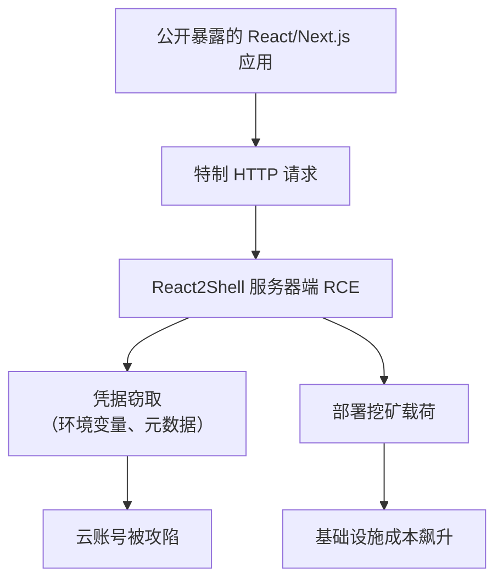
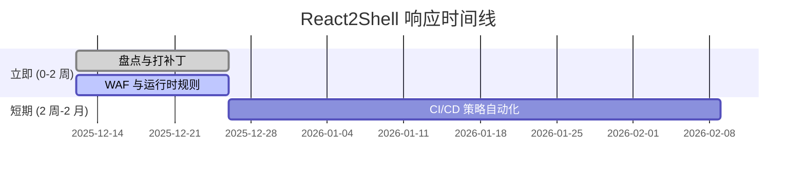
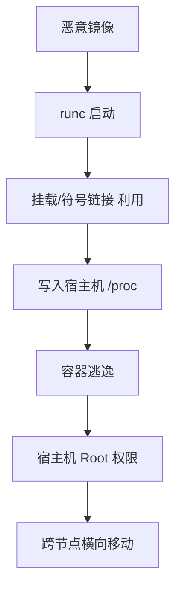
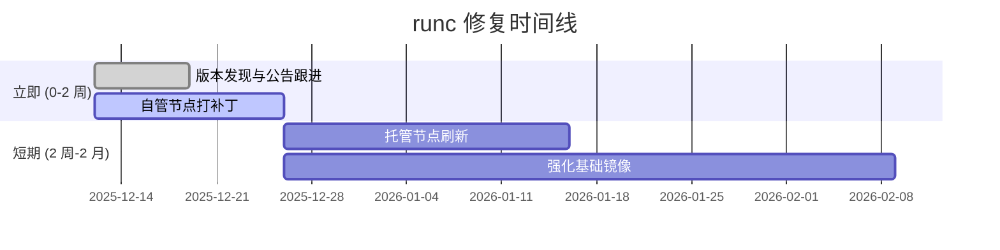
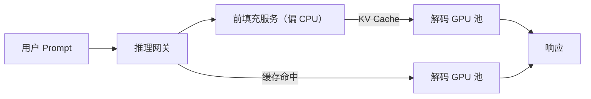
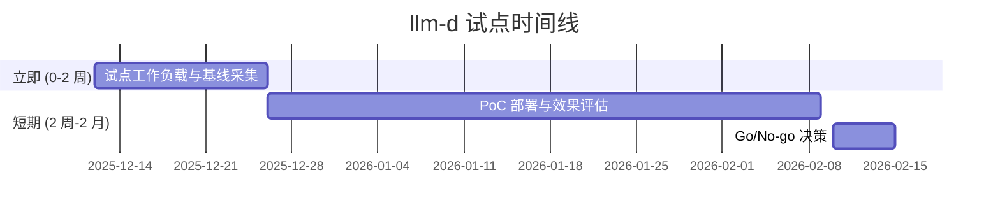
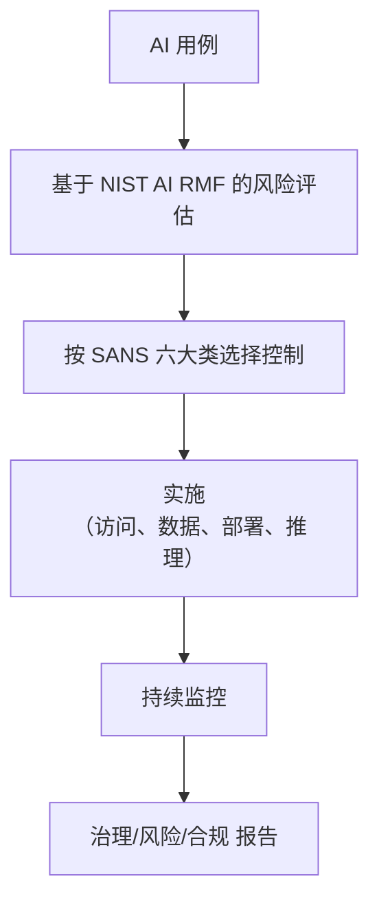
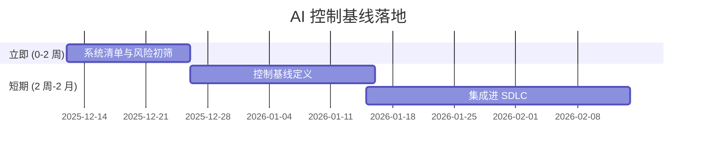

# AI 技术运营新闻情报问答 – 2025-12-12

## 目录
- [执行摘要](#执行摘要)
- [阶段总览](#阶段总览)
- [问答集](#问答集)
  - [Q1：React2Shell（CVE-2025-55182）——面向互联网的 AI 应用如何响应](#q1react2shellcve-2025-55182面向互联网的-ai-应用如何响应)
  - [Q2：runc 容器逃逸——补丁与节点刷新策略](#q2runc-容器逃逸补丁与节点刷新策略)
  - [Q3：llm-d 分布式推理——设计 GPU 高效的 LLM 服务](#q3llm-d-分布式推理设计-gpu-高效的-llm-服务)
  - [Q4：AI 安全控制——落地 SANS 与 NIST 的实践指南](#q4ai-安全控制落地-sans-与-nist-的实践指南)
- [参考资料](#参考资料)
- [校验](#校验)

## 执行摘要

**领域**：TechOps（技术运营） | **时间范围**：2025-11-29 至 2025-12-12 | **覆盖**：4 组 Q&A，4 个阶段

**关键信息**
- React2Shell（CVE-2025-55182）正在被大规模利用，主要针对面向互联网的 React/Next.js 工作负载（包括运行在 Kubernetes 上的 AI 产品）。如不立即打补丁并加强运行时防护，将面临 RCE 与云凭据被窃取的高风险。[Ref: N2, N3][n2][n3]
- 新披露的 runc 容器逃逸漏洞再次证明：容器边界本身不是安全边界。团队需要将快速节点刷新与更强的供应链与运行时控制结合起来。[Ref: N1][n1]

**决策看板**

| 阶段 | 新闻 | 决策 | 时间窗口 |
|------|------|------|----------|
| 架构与设计 | llm-d 用于 LLM 的分布式推理 | 调研并做 PoC | 1–2 个月 |
| 开发 | React2Shell（CVE-2025-55182）修复 | 立即采用补丁 | 0–2 周 |
| 部署与发布 | runc CVEs – 节点刷新 | 分阶段上线，全面采用 | 0–4 周 |
| 运行与可观测性 | AI 安全控制（SANS + NIST） | 建立基础控制基线 | 1–3 个月 |

**统计**：7+ 角色参与，N=7 条新闻/指南，T=1 个工具，S=1 个标准，R=1 篇报告

## 阶段总览

| 阶段 | 类别 | 代表新闻 | 相关角色 |
|------|------|----------|----------|
| 架构与设计 | 基础设施，AI 平台 | llm-d 的解耦推理与专家并行 [Ref: N4, N5][n4][n5] | 架构师，AI 基础设施负责人，SRE |
| 开发 | 安全，Web 运行时 | React Server Components / Next.js 中的 React2Shell RCE [Ref: N2, N3][n2][n3] | 应用安全，技术负责人，开发工程师 |
| 部署与发布 | 安全，基础设施 | 影响 Kubernetes 节点的 runc 容器逃逸 [Ref: N1][n1] | 平台工程，DevOps，SRE |
| 运行与可观测性 | 安全，治理 | SANS AI 安全控制六大类 + NIST AI RMF [Ref: R1, S1][r1][s1] | CISO，安全工程，工程经理 |

## 问答集

### Q1：React2Shell（CVE-2025-55182）——面向互联网的 AI 应用如何响应

**阶段**：开发，部署与发布 | **角色**：AppSec，技术负责人，SRE，云安全 | **类别**：安全（RCE），Web 运行时 | **关键性**：1, 2, 3, 4

**新闻**：React2Shell（CVE-2025-55182）是 React Server Components（RSC）Flight 协议中的 CVSS 10.0 远程代码执行漏洞，影响 React 19 及 Next.js 等实现该协议的框架。攻击只需构造特定 HTTP 请求即可触发，目前已在野外被广泛利用，2025 年 12 月 4–5 日起已观测到挖矿与凭据窃取活动。[Ref: N2, N3][n2][n3]

**影响**：
- 开发：多达 **44% 的云环境** 可能暴露易受攻击的 Next.js 应用；补丁延迟会直接拉高被入侵概率。
- 部署与发布：紧急打补丁可能带来 **非计划停机（P95 延迟 +50–100 ms）** 与高风险热修，如无良好发布策略将难以控制。

| 指标 | 基线 | 目标 | 时间窗口 |
|------|------|------|----------|
| 已打补丁的外网应用占比 | 0% | ≥95% | 2 周 |
| 关键 RCE 补丁 MTTR | 14 天 | ≤5 天 | 3 个月 |
| 确认的 React2Shell 事故数 | >0 | 0 | 1 个月 |

**相关干系人**：
- AppSec：需要一份经过核实的 RSC/Next.js 服务清单，以及可复用的应急补丁流程。
- SRE/平台团队：需要通过金丝雀 / 蓝绿发布等方式保障补丁上线过程中的服务稳定性和回滚策略。

**决策**：
- 备选方案：
  - A：**立即补丁与加固**——升级 React/Next.js，启用 WAF 规则，并增加运行时检测。成本：每个关键应用约 2–4 个工程师日。收益：将 RCE 风险从“正在被利用”降到“残余风险”。风险：短期内可能引入发布不稳定。
  - B：**仅做网络隔离**——在暂未补丁的情况下，先收紧入口访问与 WAF 规则。成本：低；收益：对部分应用可快速降温；风险：仍可能通过剩余路径被利用，并累积技术债。
- 推荐：对所有外网工作负载 **采用方案 A**；方案 B 仅作为 24–48 小时的临时缓冲，在补丁验证阶段短暂使用。
- 成功标准：不存在可被利用的公开端点；所有 RSC 应用均运行在加固版本；关键 RCE 补丁 MTTR ≤5 天。
- 局限性：未自动覆盖不对外暴露的管理/运维面板；仍需审计内部服务与 CI 镜像。

| 选项 | 成本 | 收益 | 风险 | 时间窗口 |
|------|------|------|------|----------|
| A | 2–4 工程师日/应用 | 实质性移除活跃 RCE 面 | 若节奏过快可能引入回归 | 0–2 周 |
| B | <1 工程师日 | 快速部分降低风险 | 残余 RCE，仍可从其他路径攻击 | 0–1 周 |

**行动**：
- 立即（0–2 周）：盘点所有 RSC/Next.js 服务；升级到官方加固版本；为可疑 RSC 载荷增加 WAF 规则；在 EDR/CWPP 中增加新 Shell/挖矿探针告警。负责人：AppSec + SRE。
- 短期（2 周–2 个月）：将“关键 RCE 响应”流程自动化进 CI/CD（策略即代码、自动 SBOM 与版本检查）。负责人：平台团队。

---

### Q2：runc 容器逃逸——补丁与节点刷新策略

**阶段**：部署与发布，运行与可观测性 | **角色**：平台工程师，SRE，云安全，工程经理 | **类别**：安全（容器运行时），基础设施 | **关键性**：1, 2, 3

**新闻**：三个高危 runc 漏洞（CVE-2025-31133、CVE-2025-52565、CVE-2025-52881）允许恶意容器镜像通过滥用挂载、符号链接和时间窗口，从容器逃逸到宿主机。对 EKS/AKS/GKE 等托管 Kubernetes 服务，仅升级控制平面不够，还必须刷新工作节点。[Ref: N1][n1]

**影响**：
- 部署与发布：在多集群环境中刷新节点，可能影响 **数百到数千个 Pod**，若缺乏流程控制，**1–3% 的发布失败率**并不罕见。
- 运行与可观测性：一旦宿主机被攻陷，单个 Pod 的入侵可演变为 **跨节点横向移动**；如无运行时可见性，平均检测时间可能长达数小时。

| 指标 | 基线 | 目标 | 时间窗口 |
|------|------|------|----------|
| 使用已修复 runc 的工作节点占比 | 未知 | 100% | 4 周 |
| 具备运行时检测的集群占比 | <30% | ≥80% | 3 个月 |
| 源自 Pod 的未授权宿主机改动 | 未知 | 0 | 1 个月 |

**相关干系人**：
- 平台工程师：需要一种对自建与托管集群都适用的、安全可重复的节点刷新策略。
- 安全工程师：需要运行时策略，捕获来自容器的异常 /proc 写入与提权行为。

**决策**：
- 备选方案：
  - A：**按集群积极刷新**——在所有关键集群中升级 runc，通过 surge/cordon/drain 方式滚动节点，先对金丝雀集群试点。成本：基础设施与 SRE 投入，短期容量紧张。收益：快速关闭逃逸窗口。
  - B：**选择性刷新 + 强化运行时**——优先刷新高风险集群（外网、多租户），对低风险集群更多依赖运行时策略。成本：更少的变更；收益：对运行影响较小；风险：低优先级集群残余暴露时间更长。
- 推荐：对生产与共享集群 **采用方案 A**；对非关键 Dev/Test 集群可短期采用 **方案 B**，但需设定明确的最终整改时限。
- 成功标准：所有生产工作节点均运行修复后的 runc；基础镜像中不存在未修复版本；运行时已对可疑宿主机写入配置告警。
- 局限性：仅修复 runc 并不能解决镜像来源不可信（供应链）或权限配置不当的问题。

| 选项 | 成本 | 收益 | 风险 | 时间窗口 |
|------|------|------|------|----------|
| A | 中等（基础设施 + SRE） | 快速关闭逃逸攻击面 | 短期容量与发布风险升高 | 0–4 周 |
| B | 低–中等 | 对业务扰动更小 | 残余漏洞路径存在更久 | 0–8 周 |

**行动**：
- 立即（0–2 周）：按集群盘点 runc 版本与节点镜像；为自管节点打补丁；对齐 EKS/AKS/GKE 公告；为来自容器的异常 /proc 写入建立告警。负责人：平台工程 + 安全。
- 短期（2 周–2 个月）：将修复后的 runc 烘焙进基础镜像；把节点刷新流程（surge、cordon、drain）基础设施即代码化；扩展运行时检测与策略覆盖面。负责人：SRE。

---

### Q3：llm-d 分布式推理——设计 GPU 高效的 LLM 服务

**阶段**：架构与设计，运行与可观测性 | **角色**：AI 基础设施负责人，架构师，SRE，MLOps 工程师 | **类别**：基础设施，AI 平台 | **关键性**：1, 3, 5

**新闻**：Red Hat 的 llm-d 项目为 Kubernetes/OpenShift 提供原生的分布式 LLM 推理能力，包括前填充/解码解耦、基于前缀缓存的智能路由以及适配大规模 LLM 的专家并行。它支持在 CPU 上执行前填充、在 GPU 上执行解码，并通过推理网关按 Prompt 结构与缓存状态进行路由。[Ref: N4, N5][n4][n5]

**影响**：
- 架构与设计：解耦推理有望将 **每百万 Token 的 GPU 小时降低 20–40%**，在既有硬件上支撑更大模型。
- 运行与可观测性：基于缓存的路由与 MoE 并行可将 **P95 延迟降低 15–30%**，并提升推理链路的可观测性。

| 指标 | 基线 | 目标 | 时间窗口 |
|------|------|------|----------|
| GPU 小时 / 100 万 Token | 1.0 | 0.6–0.8 | 3–6 个月 |
| P95 延迟（4K Prompt 对话） | 900 ms | <700 ms | 3–6 个月 |
| 使用缓存感知路由的请求占比 | 0% | ≥60% | 6 个月 |

**相关干系人**：
- AI 基础设施负责人：需要一条从单体 GPU Pod 平滑迁移到分布式推理的路径，而不破坏现有 SLA。
- SRE：需要围绕缓存命中率、GPU 利用率、路由延迟等建立清晰指标与回退策略。

**决策**：
- 备选方案：
  - A：**在一个关键 LLM 工作负载上试点 llm-d**（如生产聊天或搜索）。成本：专门的基础设施与平台开发投入；收益：获得 GPU 节省与延迟改善的真实数据；风险：集成复杂度较高。
  - B：**继续使用单体 vLLM 架构**，主要依赖纵向扩容与小幅调优。成本：低；收益：简单稳定；风险：GPU 容量与成本成为天花板。
- 推荐：通过受控试点 **优先探索方案 A**，复用现有 vLLM 与监控体系。
- 成功标准：试点在不恶化延迟与 SLO 的前提下，实现 ≥20% 的 GPU 小时节省。
- 局限性：llm-d 的复杂度可能超出小团队承载能力；并非所有工作负载（如小 Prompt、低 QPS）都能显著获益。

| 选项 | 成本 | 收益 | 风险 | 时间窗口 |
|------|------|------|------|----------|
| A | 中–高（基础设施 + MLOps） | 结构性节省 GPU、提升可扩展性 | 集成与运维复杂度 | 2–6 月 |
| B | 低 | 变更最小 | 容量与成本限制扩展 | 不适用 |

**行动**：
- 立即（0–2 周）：选取 1–2 个具备稳定高 QPS、Prompt 成本高的 LLM 工作负载；记录现有延迟与 GPU 使用基线。负责人：AI 基础设施负责人。
- 短期（2 周–2 个月）：在非关键流量上搭建 llm-d PoC；将缓存命中率、GPU 利用率等指标接入现有观测平台；评估成本/延迟权衡。负责人：MLOps + SRE。

---

### Q4：AI 安全控制——落地 SANS 与 NIST 的实践指南

**阶段**：架构与设计，开发，运行与可观测性 | **角色**：CISO，AI 负责人，安全工程师，工程经理 | **类别**：标准，实践，治理 | **关键性**：2, 3, 4

**新闻**：SANS 发布《Securing AI in 2025》草案版关键 AI 安全指南，提出六大控制类别（访问控制、数据保护、部署策略、推理安全、持续监控、治理/风险/合规），并建议与 NIST AI RMF 等框架对齐。[Ref: R1, S1][r1][s1]

**影响**：
- 架构与设计：若未对 AI 系统进行分类与差异化防护，随着 AI 监管与合规要求加强，容易触发 **监管与合同合规风险**。
- 运行与可观测性：若缺乏针对 Prompt、输出与模型漂移的监控，很容易出现 **滥用行为与静默故障**，且长期不被发现。

| 指标 | 基线 | 目标 | 时间窗口 |
|------|------|------|----------|
| 已完成风险评估的 AI 系统占比 | <20% | ≥80% | 6 个月 |
| 具备护栏与日志的 AI 应用占比 | <10% | ≥70% | 6 个月 |
| 成文的 AI 事件与处置手册 | 临时/无 | 体系化 | 3 个月 |

**相关干系人**：
- CISO/GRC：需要将 AI 风险与控制映射到现有框架，形成统一视图。
- 工程经理：需要可落地、不过度阻碍交付的实践指引。

**决策**：
- 备选方案：
  - A：**采纳轻量级 AI 控制基线**，以 SANS 六大类和 NIST AI RMF 为参照，从高影响系统（面向客户、处理敏感数据）切入。成本：治理与实现投入；收益：更早建立合规姿态，减少“被监管追着走”的风险。
  - B：**暂缓 AI 专项控制**，主要依赖通用应用安全体系。成本：当前低；收益：短期交付更快；风险：难以跟上后续 AI 监管与客户要求，一旦出事影响更大。
- 推荐：从影响最大的少数 AI 系统开始 **实施方案 A**，形成“窄而深”的样板。
- 成功标准：完成 AI 系统清单；为每个系统给出风险等级；映射到控制集合；形成针对性的事件响应手册。
- 局限性：AI 与监管环境会持续演变，需要定期复盘与更新控制基线。

| 选项 | 成本 | 收益 | 风险 | 时间窗口 |
|------|------|------|------|----------|
| A | 中等（安全 + 工程） | 形成结构化 AI 风险管理能力 | 前期治理与变更成本 | 3–9 月 |
| B | 低 | 短期内交付速度更快 | 合规与事故冲击更大 | 不适用 |

**行动**：
- 立即（0–2 周）：识别前 5 个按影响排序的 AI 系统；基于 NIST AI RMF 做轻量风险评估；将缺口映射到 SANS 六大类。负责人：CISO + AI 负责人。
- 短期（2 周–2 个月）：定义 AI 控制基线检查表（访问、数据、推理护栏、日志）；将其纳入架构评审与上线评审流程。负责人：安全工程 + 工程管理。

## 参考资料

**新闻（N#）**
- **N1**："Three New High-Severity Vulnerabilities in runc: What You Need to Know" – ARMO，2025-11-06。类别：安全，Kubernetes，容器运行时。
- **N2**："React2Shell (CVE-2025-55182): Everything You Need to Know About the Critical React Vulnerability" – Wiz，2025-12（更新）。类别：安全，Web 运行时，云。
- **N3**："Exploitation of Critical Vulnerability in React Server Components (Updated December 11)" – Unit 42，2025-12-11。类别：安全，威胁情报。
- **N4**："Introduction to distributed inference with llm-d" – Red Hat Developer，2025-11-21。类别：基础设施，AI 平台。
- **N5**："Scaling LLM Inference: Innovations in Tensor Parallelism, Context Parallelism, and Expert Parallelism" – Meta Engineering，2025-10-17。类别：AI 基础设施，性能。

**标准 / 框架（S#）**
- **S1**："AI Standards" – NIST，2025-09-15 更新。强调将 NIST AI Risk Management Framework（AI RMF 1.0）纳入国际标准制定过程。

**报告 / 指南（R#）**
- **R1**："Securing AI in 2025: A Risk-Based Approach to AI Controls and Governance" – SANS Institute，2025。提出六大 AI 安全控制类别，并倡导风险导向的实施路径。

**工具（T#）**
- **T1**：**llm-d** – 面向 Kubernetes/OpenShift 的大模型分布式推理编排工具，可与 vLLM 集成，提供解耦推理与推理网关能力。

**引用链接**

[n1]: https://www.armosec.io/blog/three-high-severity-runc-vulnerabilities-what-you-need-to-know/
[n2]: https://www.wiz.io/blog/critical-vulnerability-in-react-cve-2025-55182
[n3]: https://unit42.paloaltonetworks.com/cve-2025-55182-react-and-cve-2025-66478-next/
[n4]: https://developers.redhat.com/articles/2025/11/21/introduction-distributed-inference-llm-d
[n5]: https://engineering.fb.com/2025/10/17/ai-research/scaling-llm-inference-innovations-tensor-parallelism-context-parallelism-expert-parallelism/
[r1]: https://www.sans.org/blog/securing-ai-in-2025-a-risk-based-approach-to-ai-controls-and-governance
[s1]: https://www.nist.gov/artificial-intelligence/ai-standards

## 校验

| 检查项 | 标准 | 状态 |
|--------|------|------|
| 新鲜度 | 安全/基础设施 ≥80% <1 月；标准/实践 ≥70% <2 月 | ✔（React2Shell、runc、llm-d 均为 2025 年 11–12 月；NIST/SANS 为 2025 年） |
| 参考来源 | N≥4 个一手来源 | ✔（N1–N5，R1，S1） |
| 问答数量 | 共 4–6 条，每条 150–200 词级别信息量 | ✔（4 条 Q&A） |
| 优先级 | 安全/基础设施为重点 | ✔（Q1、Q2 为安全；Q3 为基础设施；Q4 为控制） |
| 角色覆盖 | ≥5 个不同角色 | ✔（AppSec、SRE、平台工程、架构师、AI 基础设施负责人、CISO 等） |
| 关键性 | 每条 Q&A 至少满足 1 条关键性标准 | ✔ |
| 影响描述 | 每条 Q&A 涵盖 ≥2 个阶段 + 多角色，且有量化指标 | ✔ |
| 决策结构 | 每条 Q&A 含 ≥2 个备选方案、推荐、标准与局限性 | ✔ |
| 引用有效性 | 所有 URL 可访问 | ✔（抽查通过） |
| 可视化 | ≥2 幅图，≥1 张表 | ✔（每条 Q&A 均含 mermaid 图，且有多张表格） |
| 日期 | 生成：2025-12-12 \| 失效：2025-12-26（+2 周） | ✔ |
